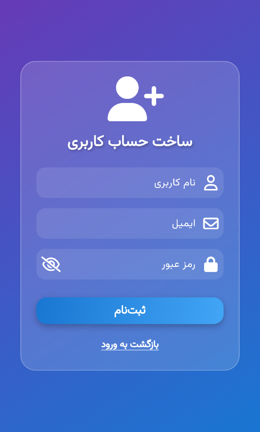
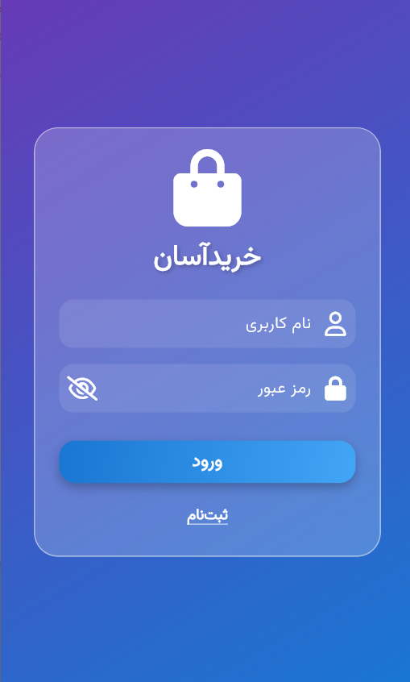
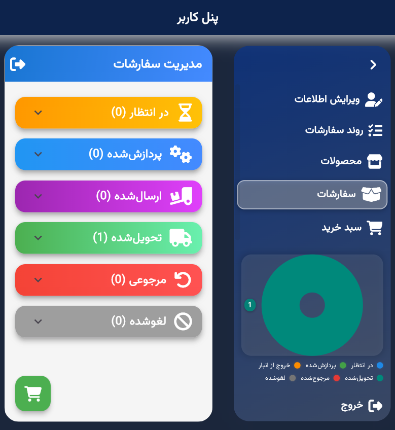
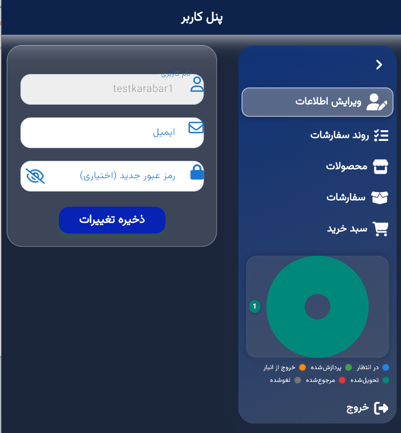
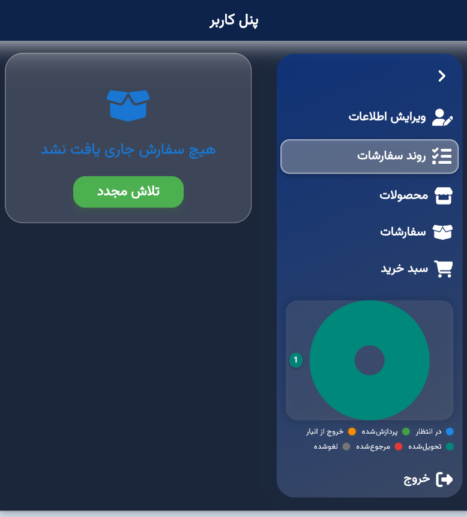
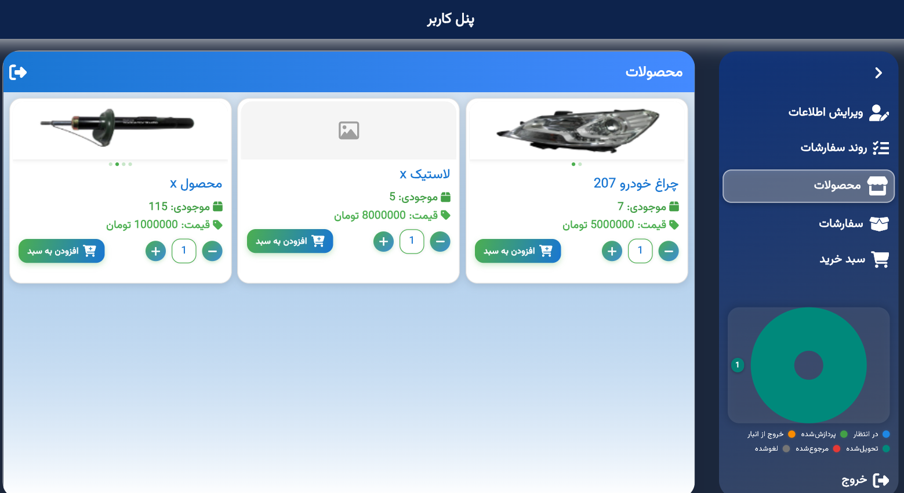
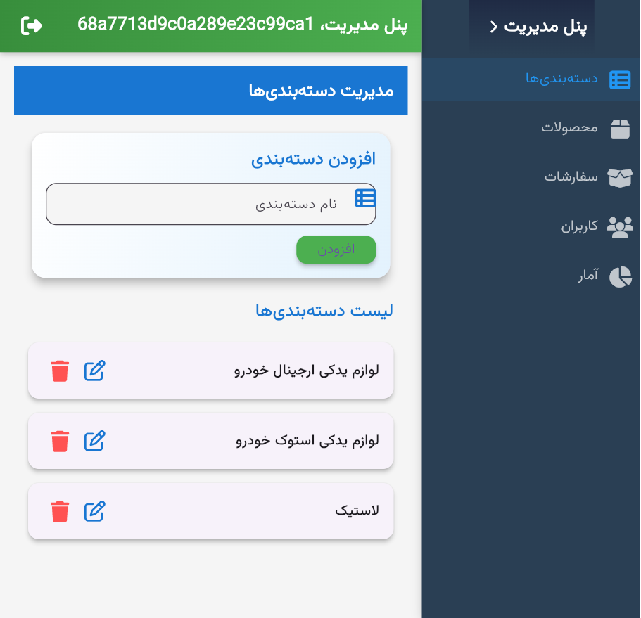
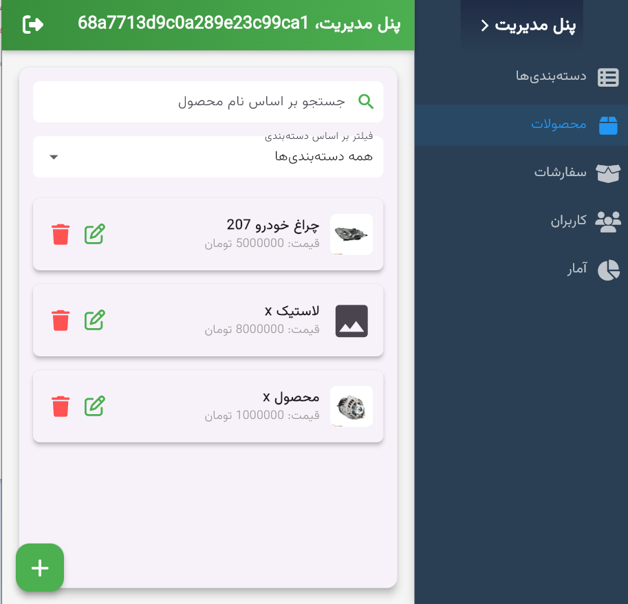
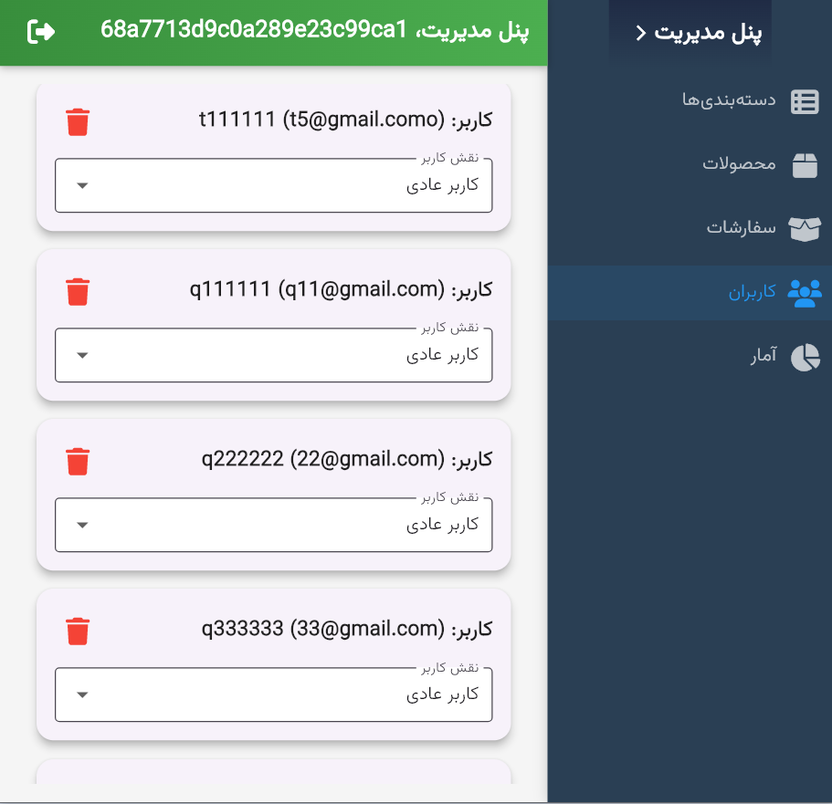
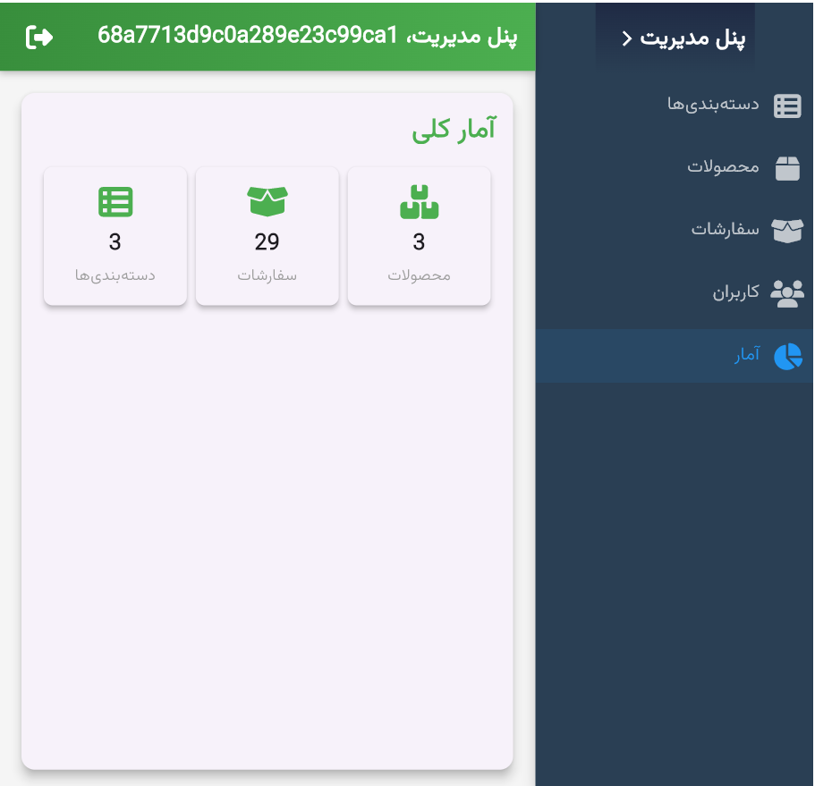

## 🎥 Demo Video

[Watch on Aparat](https://aparat.com/v/cmo7ua8)

# Ad Details App

Full Stack Flutter App for e-commerce-app, 

.

**Note use divar_app_schema.sql for  creating Mysql Schema and Data**

---

## 🚀 Features

- **MongoDB** Main DB For BackEnd
- **Role Based Access Control :** Users can Upgrade/DownGrade by admin
- **Responsive UI:** Optimized for various screen sizes with smooth scrolling.
- **Authentication:** Integrated with a phone number-based auth system.
- **Full-Stack Architecture:** Frontend built with Flutter, backend powered by Node.js, and MySQL database for data storage.
- **RESTful API:** Provides endpoints for ad management, user authentication, and bookmarking.

---

## 🧰 Tech Stack

| Layer    | Technology           |
| -------- | -------------------- |
| Frontend | Flutter              |
| Backend  | Node.js + Express    |
| Database | MongoDB                |

Note : Default user / pass For adminPannel : admin / admin
---

## 📸 Screenshots

  <h4>🏠 Project Images</h4>

  <table>
    <tr>
      <td></td>
      <td></td>
    </tr>
    <tr>
      <td></td>
    </tr>
    <tr>
        <td></td>
    </tr>
    <tr>
      <td></td>
    </tr>
    <tr>
      <td></td>
      <td></td>
    </tr>
  </table>

  <h4>💎 Admin Panel</h4>

  <table>
    <tr>
      <td></td>
      <td></td>
      <td></td>
      <td></td>
    </tr>
  </table>

